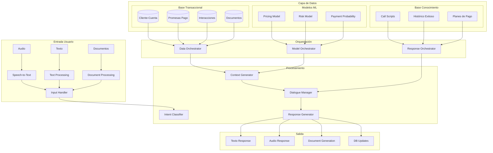

# Voice Bot Cobranza 🤖

## 📊 Descripción del Proyecto

Voice Bot Cobranza es una solución avanzada de inteligencia artificial para la automatización de procesos de cobranza, desarrollada como un POC (Proof of Concept) profesional. El sistema integra procesamiento multimodal, orquestación de modelos ML y una base de conocimiento entrenada con interacciones humanas exitosas.

## 🎯 Objetivo

Desarrollar un sistema inteligente de cobranza que combine:

- Procesamiento multimodal (voz, texto, documentos)
- Modelos predictivos de riesgo y probabilidad de pago
- Gestión automática de promesas de pago
- Interacción natural basada en casos exitosos de agentes humanos
- Orquestación inteligente de datos y modelos

## 🔄 Arquitectura del Sistema



## 🛠️ Tecnologías

- **Backend**: Python 3.9+, FastAPI
- **Base de Datos**: SQLite
- **ML/AI**:
  - OpenAI API
  - Hugging Face Transformers
  - Modelos personalizados de ML
- **Canales**:
  - WhatsApp API
  - Interfaz Web
- **Speech Processing**:
  - Speech-to-Text
  - Text-to-Speech
- **Orquestación**:
  - Data Orchestrator
  - Model Orchestrator
  - Response Orchestrator

## 📚 Componentes Principales

### 1. Capa de Entrada

- Procesamiento de Audio (Speech-to-Text)
- Procesamiento de Texto
- Procesamiento de Documentos
- Input Handler unificado

### 2. Capa de Datos

**Base Transaccional**:

- Cliente-Cuenta
- Promesas de Pago
- Interacciones
- Documentos

**Modelos ML**:

- Pricing Model
- Risk Model
- Payment Probability Model

**Base de Conocimiento**:

- Call Scripts
- Histórico de Interacciones Exitosas
- Planes de Pago

### 3. Capa de Orquestación

- Data Orchestrator
- Model Orchestrator
- Response Orchestrator

### 4. Capa de Procesamiento

- Intent Classifier
- Context Generator
- Dialogue Manager
- Response Generator

## 📂 Estructura del Proyecto

###tree -I '**pycache**|_.pyc|_.pyo|\*.log' -L 3 -F > estructura_del_proyecto.txt

```
./
├── LICENSE
├── Procfile
├── README.md
├── app/
│   ├── __init__.py
│   ├── congif.py
│   ├── routes/
│   │   ├── __init__.py
│   │   └── main.py
│   ├── services/
│   │   ├── __init__.py
│   │   ├── gemini_service.py
│   │   └── openai_service.py
│   ├── static/
│   │   ├── css/
│   │   └── js/
│   └── templates/
│       ├── base.html
│       └── index.html
├── data/
├── docker/
├── estructura_del_proyecto.txt
├── requirements.txt
├── runtime.txt
├── tests/
└── wsgi.py

11 directories, 16 files
```

## 🚀 Instalación

```bash
# Clonar el repositorio
git clone https://github.com/yourusername/voicebot-cobranza.git

# Crear entorno virtual
python -m venv venv
source venv/bin/activate  # Linux/MacOS
venv\Scripts\activate     # Windows

# Instalar dependencias
pip install -r requirements.txt
```

## 💡 Uso del Sistema

```python
# Ejemplo de uso del Orchestrator
from app.orchestration.model_orchestrator import ModelOrchestrator
from app.services.dialogue import DialogueManager

# Inicializar servicios
model_orchestrator = ModelOrchestrator()
dialogue_manager = DialogueManager()

# Procesar una interacción
async def process_interaction(input_data):
    # Obtener predicciones de modelos
    ml_insights = await model_orchestrator.get_ml_insights(input_data)

    # Generar respuesta
    response = await dialogue_manager.process_input(input_data, ml_insights)
    return response
```

## 🔍 Metodología

El proyecto implementa las mejores prácticas en:

- Procesamiento de Lenguaje Natural
- Machine Learning para Finanzas
- Diseño de Sistemas Conversacionales
- Orquestación de Modelos ML
- Gestión de Datos Transaccionales

## 🤝 Contribuciones

Las contribuciones son bienvenidas. Para cambios importantes:

1. Fork el proyecto
2. Cree su Feature Branch (`git checkout -b feature/AmazingFeature`)
3. Commit sus cambios (`git commit -m 'Add some AmazingFeature'`)
4. Push a la Branch (`git push origin feature/AmazingFeature`)
5. Abra un Pull Request

## 📝 Licencia

Este proyecto está licenciado bajo la GNU Affero General Public License v3.0 - vea el archivo [LICENSE](LICENSE) para más detalles.

Copyright (C) 2024 [Tu Nombre]. Todos los derechos reservados.

Este programa es software libre: puede redistribuirlo y/o modificarlo bajo los términos de la Licencia Pública General Affero GNU publicada por la Free Software Foundation, ya sea la versión 3 de la Licencia, o (a su elección) cualquier versión posterior.

## 🔜 Próximos Pasos

- Implementación de módulo de pagos automáticos
- Integración con sistemas CRM
- Mejora continua de modelos ML
- Escalamiento de la base de datos
- Dashboard de métricas y KPIs

## ⭐️ Agradecimientos

- OpenAI por la tecnología base de NLP
- Google AI
- Twilio por la integración con WhatsApp
- Comunidad de código abierto

## 👨‍💻 Autor

- Data Science & Analytics Professional
- 📧 Email: geramfernandez@gmail.com
- 💼 LinkedIn: [Gerardo Mayel](https://www.linkedin.com/in/gerardomayel/)
- 🐱 GitHub: [https://github.com/GerardoMayel]
